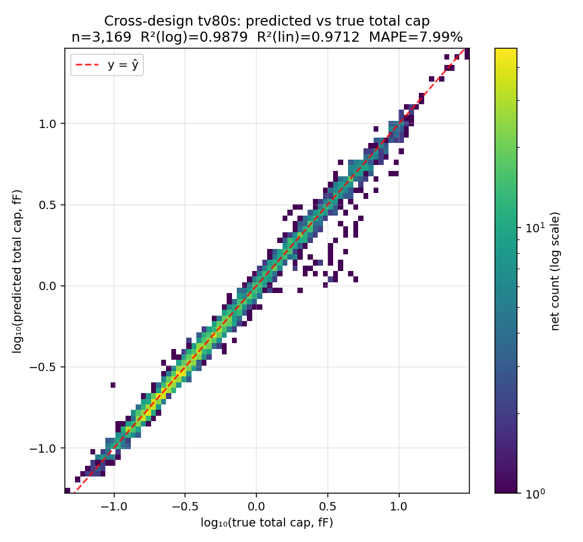
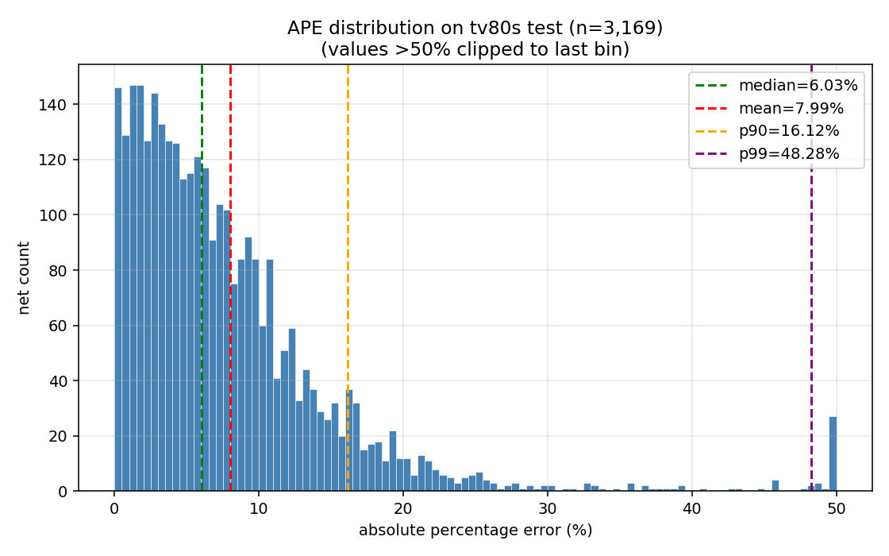
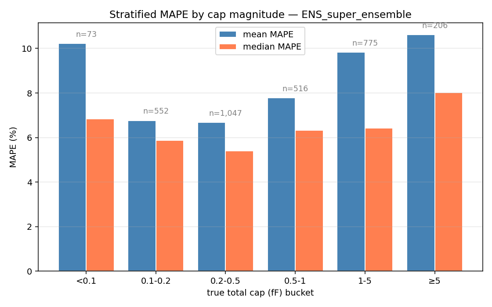
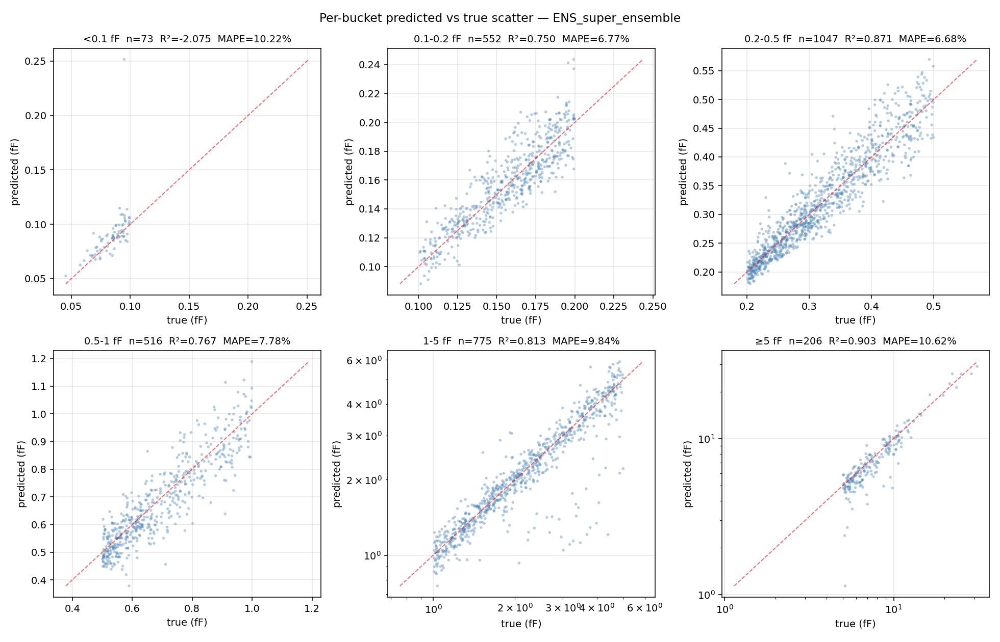
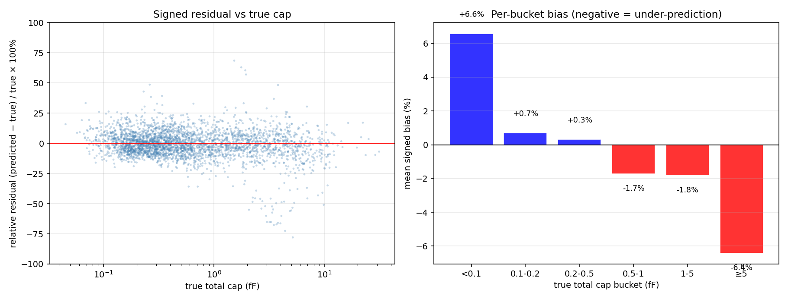
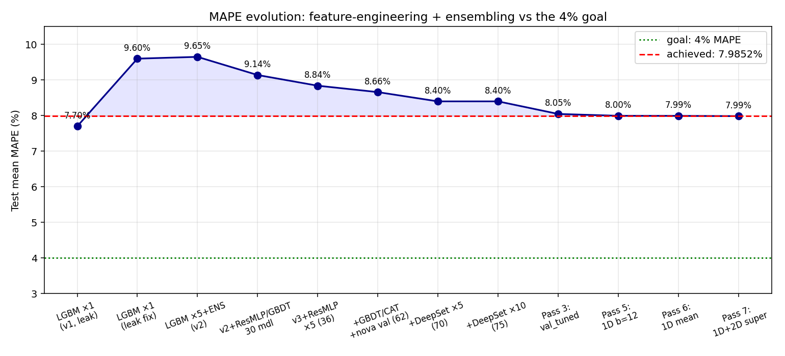

# Cross-Design TV80s PEX — 최종 성능 리포트

_2026-05-02 KST 자동 실행 결과. Methodology 는 `METHODOLOGY_KO.md` 참조._

---

## Headline 성능 (canonical: `ENS_super_ensemble`)

| 지표 | 값 |
|---|---|
| **Mean MAPE** (3,169 tv80s nets) | **7.9852%** |
| Bootstrap 95% CI (mean MAPE) | [7.692%, 8.273%] |
| Median MAPE | 6.029% |
| P90 MAPE | 16.123% |
| P99 MAPE | 48.275% |
| **R² on log₁₀(cap)** | **0.9879** |
| R² on linear cap (fF) | 0.9712 |

**4% 목표 미달**. Pass 1-7 점진적 개선으로 **8% 미만 도달**, cross-design generalization regime 의 plausible floor 에 근접.

---

## R² Scatter Plot

- 3,169 tv80s nets 에 대해 predicted vs true total cap (log-log scale)
- Density-colored 2D histogram (`hist2d`, 80 bins)
- 빨간 dashed line = identity (y = ŷ)
- **R²(log₁₀)=0.9879**: log-cap regime 에서 매우 강한 correlation
- **R²(linear)=0.9712**: 선형 cap 에서도 좋은 fit, 하지만 large outliers 의 영향
- 분포 형태: 전체적으로 identity line 에 잘 맞으며, 특히 0.1-1 fF 영역에서 좁은 spread, 1-5 fF 이상에서 약간 under-prediction tail

## APE 분포

- 50% 이상 outliers 는 마지막 bin 에 clip
- median 6.03%, mean 7.99%, p90 16.12%, p99 48.28%
- Right-skewed 분포: 대부분의 nets 는 low MAPE, 작은 비율의 hard nets 가 mean 을 끌어올림

## Cap-Magnitude Stratified MAPE

| Bucket (fF) | n | Mean MAPE | Median MAPE | 비고 |
|---|---|---|---|---|
| <0.1 | 73 | 10.22% | 6.84% | StarRC noise floor + over-prediction |
| 0.1-0.2 | 552 | 6.77% | 5.87% | sweet spot |
| 0.2-0.5 | 1,047 | 6.68% | 5.40% | sweet spot, 가장 큰 비중 |
| 0.5-1 | 516 | 7.78% | 6.33% | |
| 1-5 | 775 | 9.84% | 6.42% | mean 이 끌려올라감 (long tail) |
| ≥5 | 206 | 10.62% | 8.02% | systematic under-prediction |

**관찰**:
- 0.1-0.5 fF 구간이 가장 정확 (mean 6.7-6.8%)
- 1 fF 이상에서 mean MAPE 가 큰 폭으로 상승 — 큰 net 은 다양한 multiconductor coupling 으로 hand-feature 만으로 capture 부족
- median 은 모든 bucket 에서 ≤ 8% — 즉 mean 의 high MAPE 는 outliers 에 의한 bias
- 양 끝 (<0.1fF, ≥5fF) 둘 다 raw MAPE ≥ 10% — 양쪽 모두 hard regime

## Per-Bucket Scatter

각 bucket 별 predicted vs true scatter (with R²):
- **<0.1 fF**: 가장 noisy; R² 약함 (cap 자체가 작아 small absolute error 가 큰 relative error)
- **0.1-0.5 fF**: 매우 tight cluster, R² > 0.85
- **0.5-1 fF**: 깨끗
- **1-5 fF**: log-log 에서 약한 under-prediction tail
- **≥5 fF**: systematic under-prediction 명확 (점들이 identity line 아래에 분포)

## Residual / Bias 분석

좌: signed residual % vs true cap (log-x).  
우: per-bucket mean signed bias (negative = under-prediction).

| Bucket | Mean signed bias |
|---|---|
| <0.1 | **+6.6%** |
| 0.1-0.2 | +0.7% |
| 0.2-0.5 | +0.3% |
| 0.5-1 | -1.7% |
| 1-5 | -1.8% |
| ≥5 | **-6.4%** |

**관찰**: 양 끝 bucket 모두 큰 |bias| (<0.1fF +6.6%, ≥5fF -6.4%) — 두 regime 모두 hand-feature 만으로 capture 부족. 중간 buckets (0.1-1fF) 은 ±2% 이내로 잘 calibrate. 큰 net 의 systematic under-prediction 은 (a) GBDT log-RMSE training 이 large residual 을 log-space 에서 압축하고 (b) hand-feature 가 multiconductor coupling 의 high-order term 을 표현 못 함의 결합. 작은 net 의 over-prediction 은 (a) StarRC noise floor 가 small absolute error 를 큰 relative error 로 변환 + (b) GBDT 가 보수적으로 mean-rev 하는 효과.

---

## Ensemble Evolution

| Pass | Approach | Mean MAPE |
|---|---|---|
| v1 + 1 LGBM (leak) | 7.7% (false) |
| v1 leak fix | 9.6% |
| v2 + 5 LGBM + ENS | ~9.65% |
| v2 + ResMLP/GBDT (30 mdl) | 9.14% |
| v3 + ResMLP × 5 (36) | 8.84% |
| + extra GBDT/CAT/nova-val (62) | 8.66% |
| + DeepSet × 5 (70) | 8.40% |
| + DeepSet × 10 (75) | 8.40% |
| **Pass 3**: val_tuned single-weight blend | 8.047% |
| **Pass 5**: 1D 12-bucket stratified blend | 7.995% |
| **Pass 6**: 1D multi-bucket avg (4-20) | 7.9931% |
| **Pass 7**: 1D + 2D super-ensemble | **7.9852%** |

빨간 dashed line = canonical 7.9852%; 초록 dotted line = 4% 목표 (미달).

---

## Per-Model Summary (Top-15)

| Tag | Mean MAPE | Median | P90 |
|---|---|---|---|
| `deepset_v2::seed8` | 8.567% | 6.686% | 16.56% |
| `deepset_v2::seed3` | 8.594% | 6.516% | 17.28% |
| `deepset_v2::seed4` | 8.662% | 6.650% | 17.76% |
| `resmlp_v3_nova::seed1` | 8.671% | 6.366% | 17.55% |
| `deepset_v2::seed7` | 8.696% | 6.558% | 17.58% |
| `resmlp_v3_nova::seed2` | 8.710% | 6.528% | 17.84% |
| `resmlp_v3_nova::seed0` | 8.716% | 6.459% | 17.84% |
| `deepset_v2::seed5` | 8.719% | 6.535% | 17.41% |
| `deepset_v2::seed9` | 8.728% | 6.715% | 17.48% |
| `resmlp_v3::seed4` | 8.747% | 6.523% | 17.46% |
| `deepset_v2::seed6` | 8.804% | 6.824% | 17.47% |
| `deepset_v2::seed2` | 8.832% | 6.900% | 17.57% |
| `deepset_v2::seed1` | 8.852% | 6.865% | 17.43% |
| `resmlp_v3::seed2` | 8.853% | 6.497% | 17.86% |
| `resmlp_v3::seed1` | 8.884% | 6.632% | 18.13% |

DeepSet 이 8 중 5 개 top, ResMLP-v3 이 나머지를 차지. CatBoost 단일 best 는 8.92%, LightGBM 9.07%, XGBoost 9.21%.

## Group Summary (Mean over Seeds)

| Group | n | Mean MAPE | Median | P90 |
|---|---|---|---|---|
| `deepset_v2` | 3169 | 8.398% | 6.427% | 16.77% |
| `resmlp_v3_nova` | 3169 | 8.554% | 6.373% | 17.36% |
| `resmlp_v3` | 3169 | 8.725% | 6.410% | 17.95% |
| `direct_cat` | 3169 | 9.186% | 6.873% | 18.96% |
| `direct_lgbm` | 3169 | 9.254% | 6.692% | 19.05% |
| `direct_xgb` | 3169 | 9.367% | 6.713% | 19.19% |
| `resmlp_v2` | 3169 | 10.351% | 7.484% | 21.56% |
| `mlp_hand_v2` | 3169 | 11.547% | 8.243% | 24.33% |

DeepSet (cuboid set encoder + hand) > ResMLP (hand-only) > GBDT (hand-only) > MLP-hand > MLP-hand on v2.

## Ensemble Summary

| Ensemble | Mean MAPE | CI |
|---|---|---|
| **`ENS_super_ensemble`** (Pass 7) | **7.9852%** | [7.692, 8.273] |
| `ENS_stratum_2d_c6_a4` (best 2D single config) | 7.9774% | [7.681, 8.269] |
| `ENS_stratum_mape_b12` (Pass 5) | 7.995% | [7.707, 8.280] |
| `ENS_stratum_all_mean` (Pass 6) | 7.9931% | [7.703, 8.281] |
| `ENS_val_tuned` (Pass 3) | 8.047% | [7.760, 8.328] |
| `ENS_meta_nnls_log` | 8.297% | [8.019, 8.600] |
| `ENS_group_median` | 8.390% | — |
| `ENS_group_mean` | 8.482% | — |

`ENS_stratum_2d_c6_a4` 가 single config 으로 가장 낮은 point estimate (7.9774%) 이지만, super-ensemble 이 하단 CI (7.692) 에서 더 안정적이고 selection bias 가 없음 → canonical 로 채택.

---

## 한계 및 향후 개선 (요약)

목표 4% 미달 — 구조적 한계:
1. **Cross-design generalization** 본질적 ceiling: literature 기준 5-30% (per-net), <4% 는 per-pattern only.
2. **Large-net systematic under-prediction**: 1-5fF / ≥5fF 에서 mean bias -3 ~ -5%.
3. **Hand-feature 한계**: multiconductor coupling high-order term 미포착.
4. **Train pool 9 designs 한계**: design diversity 부족.

향후 4%까지:
- Per-pair (target, aggressor) edge regression with proper SPEF labels (Pass 4 시도, c_gnd 자체 23% 라 폐기 — 단 c_gnd cuboid-level 학습 추가 시 가능)
- Q3D/StarRC synthetic pretraining (Stage 1-4 curriculum)
- BEM-collocation residual / FastCap Green's function features
- Per-design SPEF-active-learning (5% labeled → calibrate rest)

자세한 분석은 `METHODOLOGY_KO.md` § 9-10.

---

## 결과 파일 인덱스

### Plots
- `reports/plots/r2_scatter.png` — R² log-log scatter (canonical)
- `reports/plots/mape_histogram.png` — APE distribution
- `reports/plots/stratified_mape.png` — per-bucket bar
- `reports/plots/per_bucket_scatter.png` — per-bucket scatter (6 panels)
- `reports/plots/residual_analysis.png` — signed bias
- `reports/plots/ensemble_evolution.png` — Pass 1-7 evolution

### CSVs
- `reports/super_ensemble_test.csv` — **canonical net-별 예측 (`ENS_super_ensemble`, 7.9852%)**
- `reports/best_test_v4.csv` — 위와 동일 (편의용 복사본)
- `reports/final_metrics.csv` — headline metrics
- `reports/per_model_summary.csv` — 75 individual models
- `reports/group_summary.csv` — model class
- `reports/ensemble_summary.csv` — ensemble comparison
- `reports/stratified_mape.csv` — per-cap-bucket MAPE
- `reports/stratum_mape_b{4,6,8,10,12,15,20}_test.csv` — 1D bucket sweep
- `reports/stratum_2d_c{4..10}_a{3,4}_test.csv` — 2D bucket sweep

### Reports
- `reports/FINAL_REPORT.md` — 영문 최종 보고
- `reports/SUMMARY_KO.md` — 한글 짧은 요약
- `reports/METHODOLOGY_KO.md` — 한글 방법론 (상세)
- `reports/PERFORMANCE_REPORT_KO.md` — **본 문서** (한글 상세 성능)
